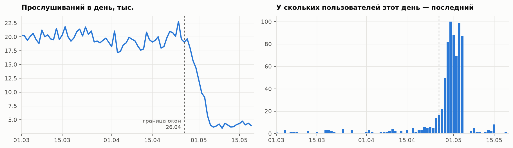
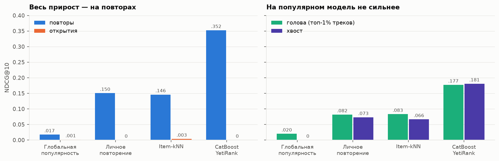
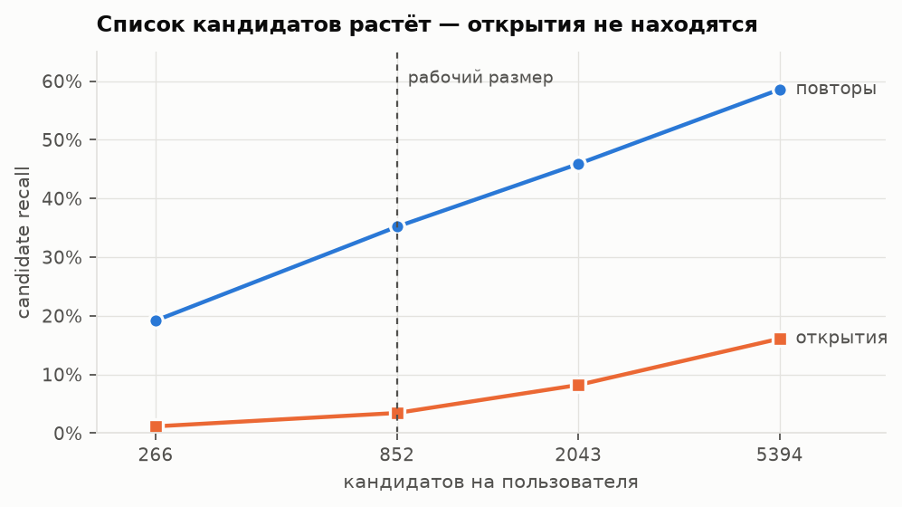
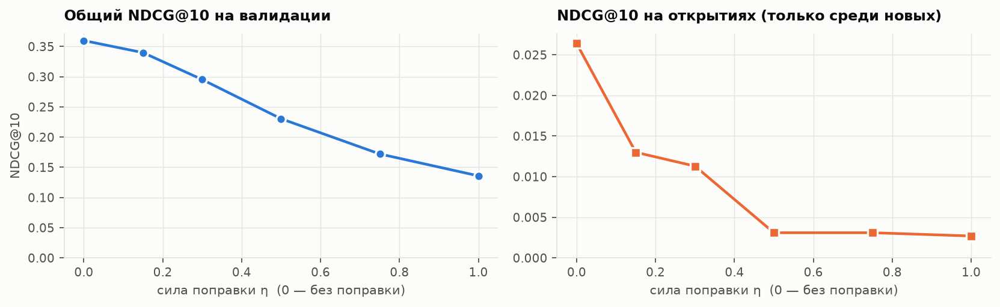

# Музыкальные рекомендации на Last.fm: откуда берётся прирост и какая его часть настоящая

Данные — [Last.fm-1K](http://ocelma.net/MusicRecommendationDataset/lastfm-1K.html): полные истории
прослушиваний 992 пользователей до мая 2009 года, 19.15 млн событий, 1.5 млн треков. Задача —
отранжировать треки под пользователя на следующую неделю по его истории.

Цель проекта — не максимальная метрика, а честный ответ на вопрос, **что именно улучшает модель**.
Рекомендации часто подсовывают либо то, что человек слушал сто раз, либо усреднённый популярный трек.
Поэтому всё меряется в двух разрезах: **повторы против открытий** (трек уже был в истории
пользователя или новый для него) и **голова против хвоста** популярности.

Весь код и выводы — в [`lastfm_ranking.ipynb`](lastfm_ranking.ipynb).

**Стек:** Python, polars, CatBoost (`CatBoostRanker`, YetiRank), numpy, matplotlib. Метрики
ранжирования, кандидатогенерация, IPW-перевзвешивание и бутстреп написаны вручную.

## Коротко

- **CatBoost YetiRank даёт NDCG@10 0.330 против 0.141** у лучшего бейзлайна — **+134%**. Прирост
  настоящий: сплит по времени, признаки только из прошлого, тест использован один раз, 95%
  интервалы бутстрепа не перекрываются.
- **Но весь прирост — на повторах.** Топ-10 состоит из знакомых треков у всех 300 пользователей без
  исключения; лучшее угаданное открытие стоит на 144-й позиции. Модель не рекомендует музыку —
  она переставляет то, что человек и так слушает.
- **Узкое место — кандидатогенерация, а не ранжирование.** До ранжирования доходит 3.4% открытий
  против 35% повторов, и расширение списка кандидатов в шесть раз этот разрыв не закрывает.
- **Дебайас не помог — и это объяснимо.** Popularity bias, который собирались лечить, здесь
  отсутствует, а перевзвешивание топит единственный тип открытий, который воронка умеет находить.
  Валидация выбрала «не поправлять»; поправка на повторы тоже не вышла за пределы шума.
- **Три тихих бага одного класса** — ничьи при сортировке и неопределённый порядок строк. Ни один
  не падал с исключением, все возвращали правдоподобные числа; нашлись благодаря аудиту утечек.

## Как меряем

- **Данные кончаются не там, где написано.** Описание обещает истории до 5 мая, но сбор шёл по
  списку пользователей несколько дней, и история каждого обрывается там, где до него дошла
  очередь. Если бы тестовое окно кончалось 5 мая, обрыв пришёлся бы на него у 82% активных
  пользователей, а метка «не слушал» в такой зоне ничего не значит. Поэтому все окна кончаются
  26 апреля: там таких 10%, и это уже настоящий отток.

  

- **Три недельных окна подряд:** обучение → подбор настроек (ранняя остановка, сила поправки) →
  финальный замер. Неделя, а не месяц: за месяц человек слушает ~280 разных треков, за неделю ~85,
  и только второе имеет смысл предсказывать списком кандидатов.
- **Пользователи отбираются по активности в обучающем периоде**, а не в тестовом: иначе это отбор
  по будущему. 300 из 937 подходящих, со всей историей.
- **Метрики написаны руками** и сверены с примером, посчитанным на бумаге, — потому что в них есть
  два решения, которые библиотека принимает молча. Первое: в знаменателе NDCG — все треки,
  которые пользователь послушал, а не только те, что достала воронка. Иначе промахи воронки
  исчезают из метрики, а на срезе открытий из расчёта выпадают 106 пользователей из 198. Второе:
  ничьи разрываются случайно. У бейзлайна «личное повторение» сотни кандидатов получают ноль, и
  стабильная сортировка ставит наверх то, что раньше лежало в списке, — на проверочном примере
  это NDCG 1.000 вместо 0.275 на одних и тех же данных.
- **Бутстреп по пользователям** перед любым выводом из третьего знака.

## Результаты

NDCG@10 на тестовой неделе, 300 пользователей. «Открытия» — релевантными считаются только новые
для пользователя треки, выдача та же.

| Подход | NDCG@10 | повторы | открытия | голова | хвост | MRR | Recall@50 |
|---|---|---|---|---|---|---|---|
| Глобальная популярность | 0.0177 | 0.0173 | 0.0013 | 0.0199 | 0.0000 | 0.0645 | 0.0051 |
| Личное повторение | 0.1412 | 0.1505 | 0.0000 | 0.0816 | 0.0729 | 0.2870 | 0.0463 |
| Item-kNN (co-occurrence) | 0.1410 | 0.1459 | 0.0034 | 0.0830 | 0.0663 | 0.2195 | 0.0457 |
| **CatBoost YetiRank** | **0.3299** | 0.3523 | **0.0000** | 0.1771 | 0.1807 | 0.4703 | 0.1128 |
| CatBoost + дебайас (η = 0, выбран на валидации) | 0.3299 | 0.3523 | 0.0000 | 0.1771 | 0.1807 | 0.4703 | 0.1128 |
| CatBoost + дебайас (η = 0.5, принудительно) | 0.2208 | 0.2348 | 0.0000 | 0.0004 | 0.2224 | 0.3683 | 0.0816 |

95% интервалы: CatBoost [0.286; 0.378], личное повторение [0.111; 0.168].



## Воронка — потолок для открытий

Кандидатов собирают пять источников: история пользователя по свежести и по частоте, соседи по
совместным прослушиваниям (co-occurrence с нормировкой на популярность — иначе лучшим соседом
любого трека окажется главный хит), популярные треки знакомых артистов, которых пользователь ещё
не слышал, и глобальный топ. Около 850 кандидатов на пользователя, в них попадает 25% того, что он
послушает.

Первая версия воронки находила 11%. Помогли две вещи: отбор истории **по свежести** работает лучше
отбора по частоте (медианная библиотека — 3.5 тысячи треков), и не хватало каталога знакомых
артистов — на него приходится 64% всех новых для пользователя треков и 60% угаданных открытий.

А дальше упор. Повторы находятся всё лучше с ростом списка, открытия — нет:



Открытие — это конкретный трек из полутора миллионов, и даже сузив круг до знакомых артистов,
приходится искать одну песню среди сотен в их каталогах. Любой прирост от бустинга поверх такой
воронки будет приростом на повторах.

Пример из разбора ошибок: у одного пользователя топ-10 — знакомые треки Death Cab For Cutie и
Band Of Horses, а впервые он слушал в ту неделю диджейские миксы и подкасты. Ни один из них не
дошёл даже до списка кандидатов.

## Дебайас: две попытки

Единица в обучающей выборке значит «послушал», но чтобы послушать, трек надо сначала встретить,
а это зависит от популярности. Стандартное лечение — IPW: вес примера обратно пропорционален
вероятности его наблюдения. Логов показов нет, поэтому вероятность приближена популярностью,
$w \propto \mathrm{pop}^{-\eta}$, а сила поправки η подбирается на валидации.

Попутно выяснилось, что YetiRank — попарный лосс — схлопывает веса объектов до уровня группы
(CatBoost пишет об этом в stderr). Проверка перестановкой весов внутри групп: эффект на 2–3 порядка
слабее, чем у listwise-лоссов. Без этой проверки дебайас молча оказался бы пустышкой. Поэтому вес
занесён прямо в метку: YetiRank умеет градуированную релевантность.



Обе метрики падают монотонно, валидация выбирает η = 0. Три замера объясняют почему:

1. модель почти не опирается на популярность — 16% важности против 52% у признаков повтора;
2. на популярном она не лучше, чем на редком (0.177 против 0.181) — смещения, которое собирались
   лечить, здесь нет;
3. среди открытий, до которых дотягивается воронка, популярных 55% против 16% среди открытий
   вообще — штраф за популярность топит единственные открытия, которые модель умеет находить.

Поправка на повторы — смещение, которое здесь действительно есть, — дала то же самое: общая метрика
падает, а разброс метрики открытий по всему свипу вдвое меньше ширины бутстреп-интервала одной
точки. Механизм при этом исправен: принудительный η = 0.5 роняет метрику на популярном с 0.177
почти до нуля и поднимает на хвосте до 0.222. Инструмент работает, диагноз был неверный.

**Весами в лоссе не поднять наверх то, чего нет в списке кандидатов.**

## Три бага одного класса

Аудит утечек физически выкидывает тестовое окно, пересчитывает признаки и сверяет с полными
данными. Утечек он не нашёл, зато нашёл три бага:

- на границе топ-50 тысяч треков для co-occurrence стоит больше восьмисот треков с одинаковой
  популярностью, и сортировка разбивала ничью по-разному от запуска к запуску;
- выборка пользователей не воспроизводилась при фиксированном seed: `group_by` в polars не
  гарантирует порядок строк, а `rng.choice` выбирает по позициям — совпадало 98 человек из 300;
- сравнение признаков на точное равенство падало из-за параллельного суммирования float в
  последнем бите мантиссы.

Общее у всех трёх: порядок при равных значениях нигде не был задан явно — тот же класс ошибки,
что и с ничьими в метриках.

## Чего здесь измерить нельзя

**Position bias.** Last.fm-1K — логи прослушиваний, а не логи показов: что пользователю показывали и
в каком порядке, в данных нет. По той же причине невозможна counterfactual-оценка «что было бы
при другой выдаче» — для неё нужна логирующая политика с известными вероятностями показа.
Поэтому вместо position bias разбираются два смещения, которые здесь есть: популярность и повторы.

## Что дальше

- **Разделить задачу на две.** Повторы и открытия требуют разных признаков и разных источников
  кандидатов; смешивать выдачи — с явной квотой на новизну.
- **Контентные признаки** (эмбеддинги названий треков и артистов) — проверка узкая: помочь они
  должны именно на открытиях, а не на повторах.
- **Последовательные модели** (SASRec, BERT4Rec) — после разделения срезов, иначе их прирост
  будет так же неинтерпретируем.
- **A/B:** рандомизация по пользователю, 3–4 недели (новизна почти всегда даёт просадку в первые
  дни). Основная метрика назначается заранее — доля непропущенных прослушиваний; целевая — доля
  новых артистов; ограничители — удержание на четырёх неделях и доля хвоста в выдаче. Против
  feedback loop — небольшой рандомизированный слот в выдаче: он же даёт данные для настоящей
  counterfactual-оценки.

## Структура

```
lastfm_ranking.ipynb   весь код и выводы: данные, метрики, воронка, CatBoost, смещения, дебайас
figures/               графики из ноутбука
requirements.txt
```

## Запуск

```bash
pip install -r requirements.txt
jupyter lab lastfm_ranking.ipynb
```

Дальше Run All. Ноутбук сам скачает датасет (~673 МБ с [Zenodo](https://zenodo.org/records/6090214)),
разберёт его в parquet в `data/processed/` и закеширует тяжёлые шаги в `data/cache/`. Всё считается
на CPU: полный прогон с нуля — около получаса на ноутбуке, повторный — несколько минут. Числа в
ноутбуке получены при `N_THREADS = 6`: результат CatBoost может зависеть от числа потоков.
Лицензия датасета — только некоммерческое использование.
